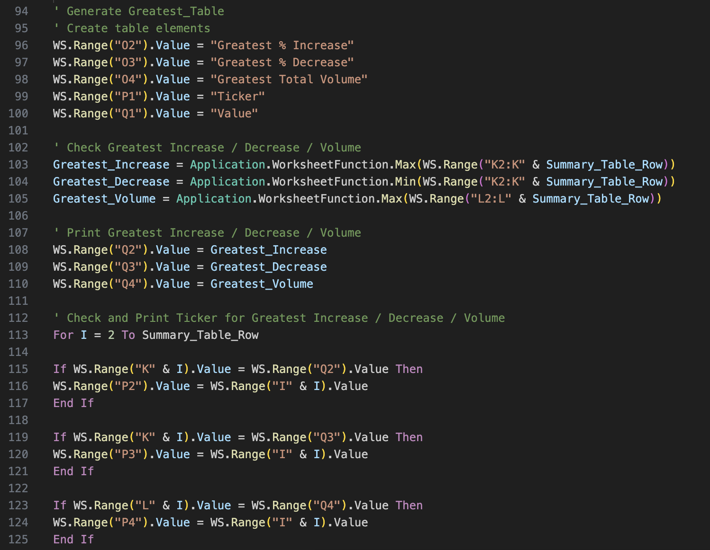
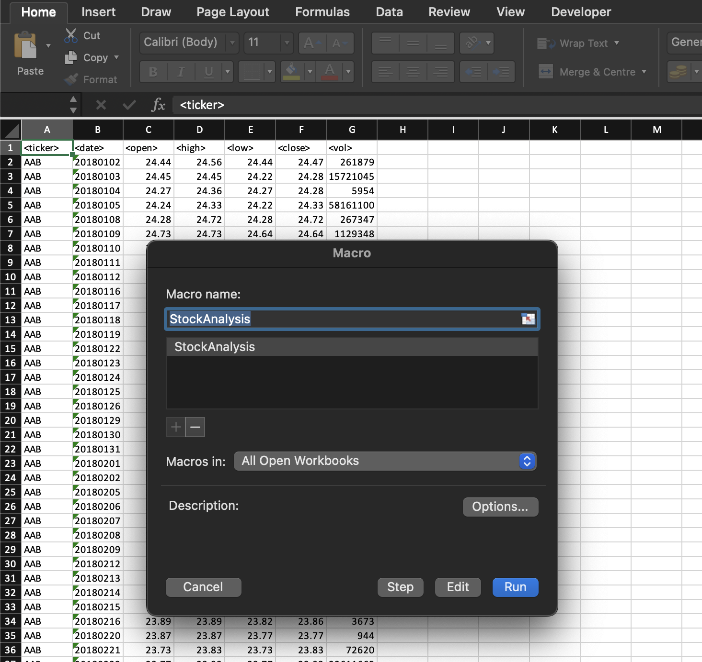
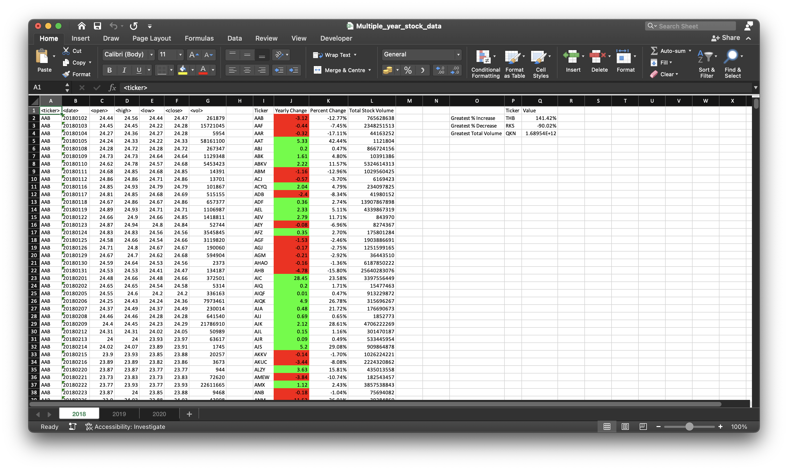

# vba-challenge
Stock Market Analysis with VBA

## Contents
1. [Overview](#1-overview)  
2. [Repository](#2-repository)  
3. [Deployment](#3-deployment)  
4. [Data Analysis](#4-data-analysis)  
5. [References](#5-references)  

## 1. Overview
This challenge focuses on analysing stock market data using VBA (Visual Basic for Applications) scripting in Excel. The task is to create a script that loops through quarterly stock data and calculates key metrics, including the ticker symbol, quarterly price changes, percentage change, total stock volume, and highlights the stocks with the greatest percentage increase, greatest percentage decrease, and greatest total volume. Additionally, the script applies conditional formatting to highlight positive and negative changes in stock prices, making the results visually clear and easy to interpret.

## 2. Repository
The repository contains the following files and folders:

- [`StockAnalysis.bas`](StockAnalysis.bas) - The VBA script used for stock data analysis.
- [`images/screenshots/`](images/screenshots) - Folder containing screenshots of analysis results for different years.
  - [`screenshot_2018.png`](images/screenshots/screenshot_2018.png)
  - [`screenshot_2019.png`](images/screenshots/screenshot_2019.png)
  - [`screenshot_2020.png`](images/screenshots/screenshot_2020.png)

**External Files (click to download):**

- [`Multiple_year_stock_data.xlsx`](https://drive.google.com/file/d/1aamA2lVvYkGzo3dpvHQuRJW0Y3c0Rv9q/) - Raw Excel file. (File Size: Approximately 80 MB)
- [`Multiple_year_stock_data_automated.xlsm`](https://drive.google.com/file/d/18c39lX7tpFv7dAIpHjBPYHblvTQDnQHT/) - Excel file preloaded with the VBA script. (File Size: Approximately 100 MB)  

## 3. Deployment

Simple Method:

1. Download the Repository: Download this repository to your local computer. (Note: The file size is large.)
2. Open the Excel File: Launch the file `Multiple_year_stock_data_automated.xlsm` in Excel. When prompted, enable macros by clicking “Enable Content” on the security warning banner.
3. Access the Macro Dialog: Press `Alt + F8` (Windows) or `Option + F8` (Mac) to open the Macro Dialog, or go to the Developer tab and click Macros.
4. Select the Macro: In the Macro Dialog, choose the macro named `StockAnalysis()`.
5. Run the Macro: Click the Run button to execute the macro. The script will process all quarterly data and output the analysis in the worksheet.

Alternative Method:

1. Download the Repository: Download this repository to your local computer. (Note: The file size is large.)
2. Import the `StockAnalysis.bas` script:
  - Open the Excel File: Open `Multiple_year_stock_data.xlsx` in Excel.
  - Open the VBA Editor: `Press Alt + F11` (Windows) or `Option + F11` (Mac) to launch the VBA editor.
  - Insert a New Module: In the VBA editor, right-click `ThisWorkbook` in the Project Explorer pane. Select Insert, then choose Module.
	- Paste or Import the Script:
	  - To Paste the Script: Copy the VBA code and paste it into the new module window.
	  - To Import the Script: Go to `File > Import File`, then select the `StockAnalysis.bas` file.
	-	Save as Macro-Enabled Workbook: Close the VBA editor by pressing `Alt + Q` (Windows) or `Command + Q` (Mac). Save the workbook as a .xlsm file (Macro-Enabled Workbook) via `File > Save As`.
	-	Enable Macros: When reopening the .xlsm file, enable macros by clicking “Enable Content” on the security warning banner.
	3.	Run the Macro `StockAnalysis()`:
	-	Open the Macro Dialog: Press `Alt + F8` (Windows) or `Option + F8` (Mac), or go to the Developer tab and click Macros.
	-	Select the Macro: From the list of macros, select `StockAnalysis()`.
	-	Run the Macro: Click Run to execute the script. The script will process all quarterly data and output the analysis in the worksheet.

## 4. Data Analysis
The script analyses stock data for each quarter and calculates the following:
- **Ticker Symbol**: Identifies the stock being analysed.
- **Quarterly Change**: The difference between the opening price at the start of the quarter and the closing price at the end of the quarter.
- **Percentage Change**: The percentage change in the stock's price over the quarter.
- **Total Stock Volume**: The total volume of the stock traded during the quarter.

The script also identifies and returns:
- The **Greatest % Increase** in stock price across all quarters.
- The **Greatest % Decrease** in stock price across all quarters.
- The **Greatest Total Volume** of stocks traded in a quarter.

Results are displayed directly in the worksheet with the appropriate columns, and conditional formatting is applied to visually highlight:
- Positive changes in stock prices in **green**.
- Negative changes in stock prices in **red**.

## 5. References

Data for this dataset was generated by **edX Boot Camps LLC** and is intended for educational purposes only.
